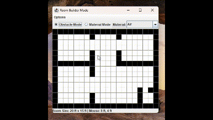

# <p align="center">Sound Wave Simulator:<br>Visualizing sound propagation with precision</p>
AcoustX is a physics-based tool that brings sound waves to life. Using linear PDEs and real-time visualizations, this project lets you design environments and observe how sound interacts with walls, obstacles, and space. Perfect for acoustics enthusiasts, educators, and audio engineers.

## Demo
<div align="center">  </div> <p align="center">Current progress:<br>Simulates sound wave propagation in 2D environments with user-defined room layouts and visualizations of intensity and pressure changes.</p>

## Features
- Real-time sound wave simulation based on wave equations
- Interactive Room Builder Mode for custom layouts
- Dynamic visualization of reflections, interference, and absorption 🔊
- Adjustable source and boundary properties

## Installation
1. Clone the repo:
```md
git clone https://github.com/MangoStikkyRice/SoundWaveSimulator.git
```
2. Run main.java (Project is WIP)
